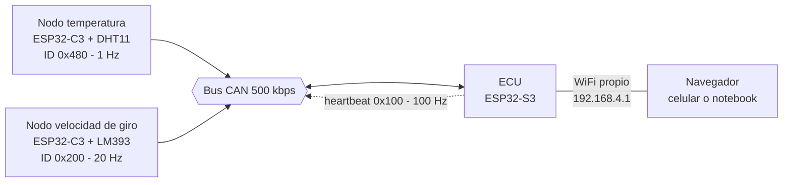
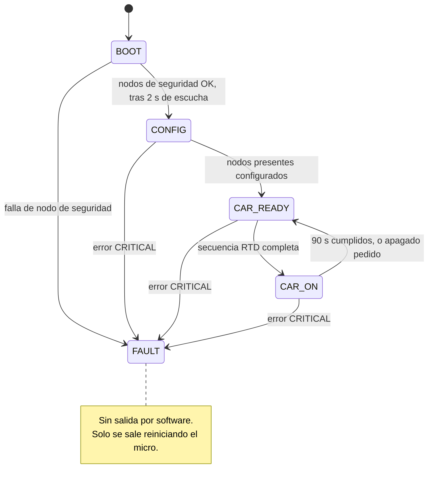
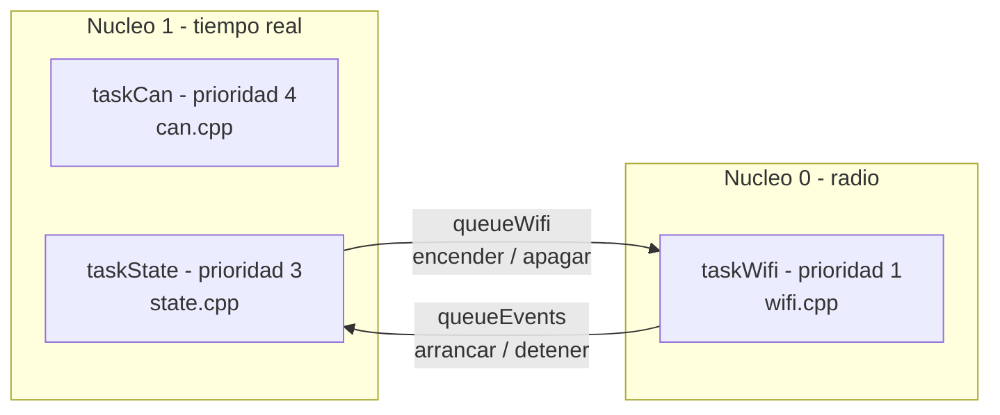
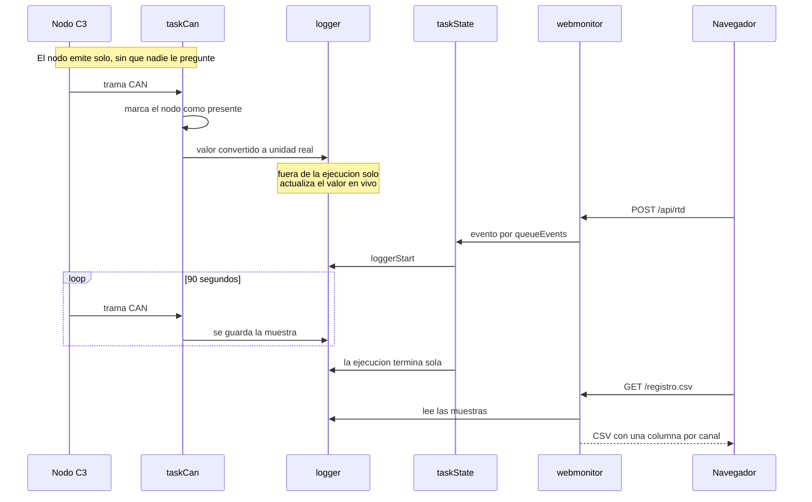
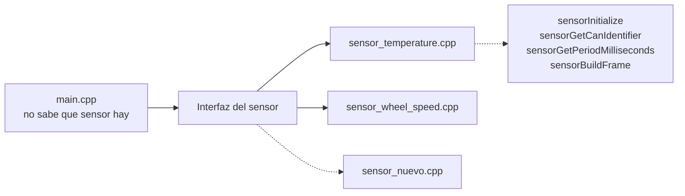

# Arquitectura del firmware

Vista de alto nivel de como esta armado el codigo de la ECU y de los
nodos sensores.

- Como correr la prueba: [PRUEBA.txt](../PRUEBA.txt)
- Decisiones tomadas y pendientes: [TODO.txt](TODO.txt)
- Mapa de identificadores CAN: [include/can_ids.h](include/can_ids.h)

---

## 1. Que hay conectado

Cada sensor vive en su propia placa y publica por CAN. La ECU no lee
ningun sensor de forma directa: solo escucha el bus.

Cada placa necesita su transceiver: el controlador del ESP32 habla en
niveles logicos de 3.3 V, y el bus CAN es diferencial.

---

## 2. Maquina de estados del vehiculo

Un solo lugar del programa decide en que estado esta el auto:
[state.cpp](src/state.cpp).

El led RGB de debug muestra el estado: BOOT azul, CONFIG amarillo,
CAR_READY verde fijo, CAR_ON verde pulsante, FAULT rojo.

CONFIG dura unos 10 ms mientras no exista el mensaje de configuracion
de nodos, asi que en el led practicamente no se ve.

---

## 3. Como esta dividido el codigo de la ECU

Tres tasks. El nucleo 1 corre lo que tiene que ser predecible, y el 0
queda para la radio, que es donde el stack de WiFi ya corre lo suyo.

Las tasks no comparten variables sueltas: se hablan por colas.

Los demas archivos no tienen task propia: son modulos que las tasks
llaman.

| Archivo | Que hace | Quien lo usa |
| --- | --- | --- |
| `state.cpp` | Maquina de estados | taskState |
| `can.cpp` | Bus CAN: envio, recepcion y despacho | taskCan |
| `wifi.cpp` | Punto de acceso y actualizacion OTA | taskWifi |
| `sensors.cpp` | Que nodos estan presentes | taskCan, taskState |
| `logger.cpp` | Guarda las muestras de la ejecucion | taskCan, webmonitor |
| `errors.cpp` | Registra y latchea las fallas | las tres tasks |
| `indicators.cpp` | Led RGB de debug | taskState |
| `webmonitor.cpp` | Pagina, JSON y CSV | taskWifi |

El bus CAN tiene mas prioridad que la maquina de estados a proposito:
no puede perder tramas esperando a que los estados terminen su vuelta.

---

## 4. Que pasa durante una ejecucion

El nodo nunca espera una orden: arranca midiendo y emitiendo. Eso es lo
que permite que la ECU lo descubra con solo escuchar, y que un nodo
ausente no trabe nada.

---

## 5. Como se agrega un sensor nuevo

Del lado del nodo, un sensor son cuatro funciones declaradas en
[SensorNode.h](../SensorNode/include/SensorNode.h). `main.cpp` no sabe que
sensor tiene conectado: se lo pregunta a esa interfaz.

Los pasos:

1. Copiar uno de los `sensor_*.cpp` e implementar las cuatro funciones.
2. Definir el identificador y el layout de su trama en `can_ids.h`:
   unidad, escala, rango y endianness. Si emisor y receptor no coinciden
   en los cuatro, el dato no falla, miente en silencio.
3. Agregar un entorno en el `platformio.ini` del nodo. El archivo del
   sensor se elige con `build_src_filter`, asi que no hace falta ningun
   `#ifdef`.
4. Del lado de la ECU, sumar el handler en `can.cpp` y el canal en
   `LogChannel`.

No hay que tocar `main.cpp` ni `can.cpp` del nodo.
