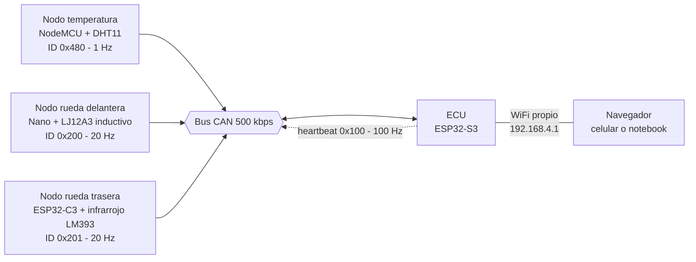
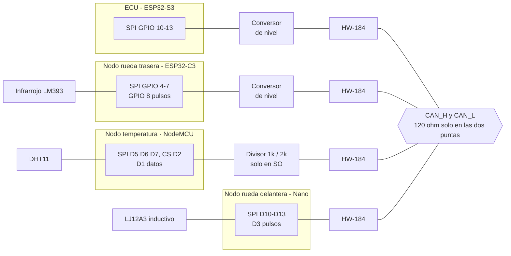
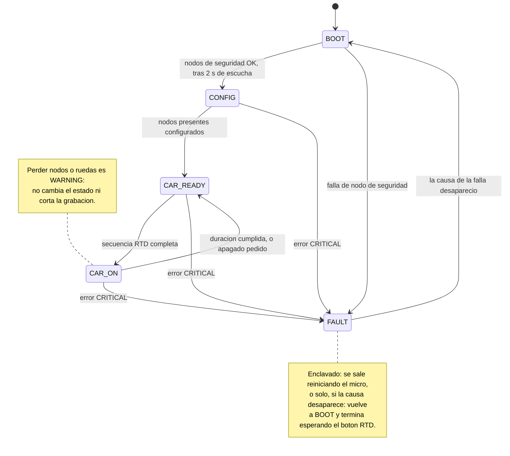
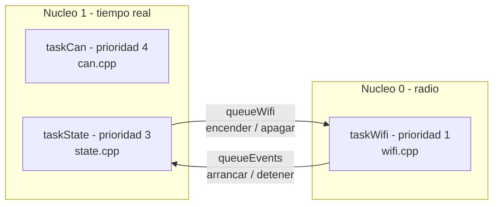
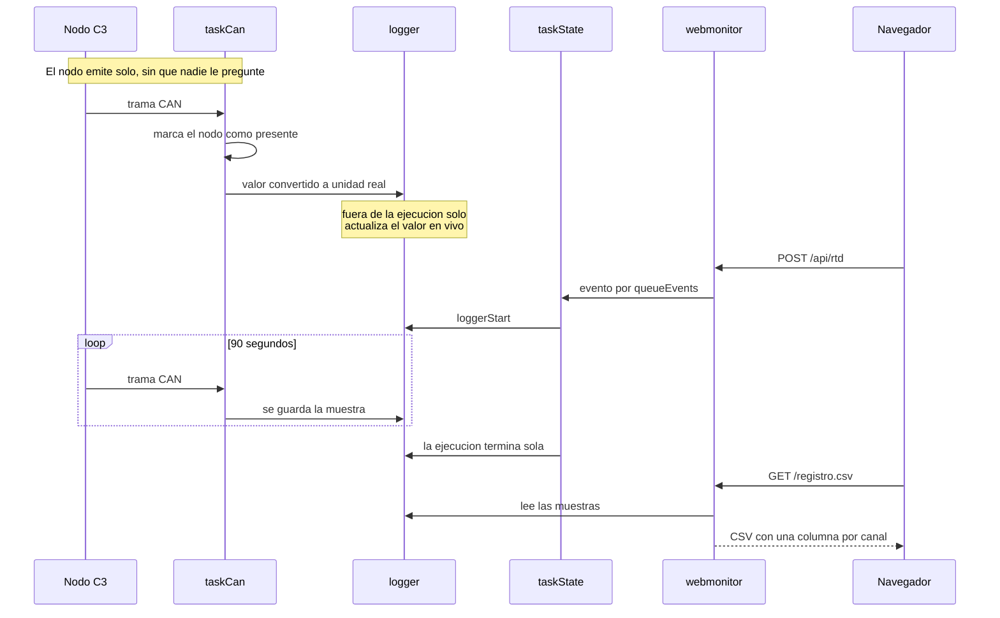
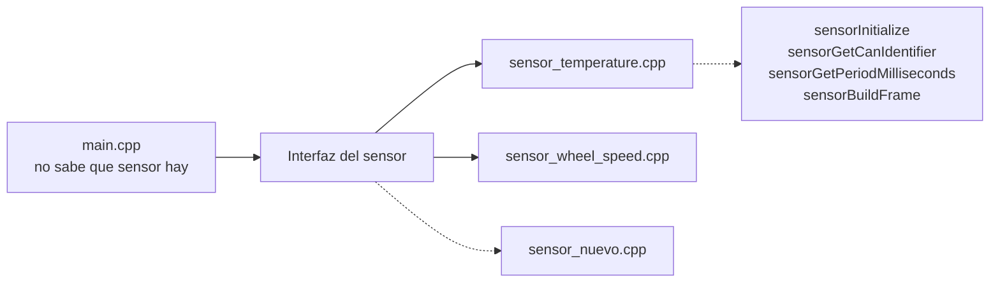

# Arquitectura del firmware

Vista de alto nivel de como esta armado el codigo de la ECU y de los
nodos sensores.

- Como correr la prueba: [PRUEBA.txt](../PRUEBA.txt)
- Decisiones tomadas y pendientes: [TODO.txt](TODO.txt)
- Mapa de identificadores CAN: [include/can_ids.h](include/can_ids.h)

---

## 1. Que hay conectado

Cada sensor vive en su propia placa y publica por CAN. La ECU no lee
ningun sensor de forma directa: solo escucha el bus.

```mermaid
flowchart LR
    N1["Nodo temperatura<br/>NodeMCU + DHT11<br/>ID 0x480 - 1 Hz"]
    N2["Nodo rueda delantera<br/>Nano + LJ12A3 inductivo<br/>ID 0x200 - 20 Hz"]
    N3["Nodo rueda trasera<br/>ESP32-C3 + infrarrojo LM393<br/>ID 0x201 - 20 Hz"]
    BUS{{"Bus CAN 500 kbps"}}
    ECU["ECU<br/>ESP32-S3"]
    PC["Navegador<br/>celular o notebook"]

    N1 --> BUS
    N2 --> BUS
    N3 --> BUS
    BUS <--> ECU
    ECU -. "heartbeat 0x100 - 100 Hz" .-> BUS
    ECU ---|"WiFi propio<br/>192.168.4.1"| PC
```

Los dos sensores de rueda son distintos por dentro y comparten codigo:
los dos bajan su salida a cero cuando pasa algo por delante. Con dos
ruedas reportando, la ECU ya puede calcular la velocidad del auto y
descartar la que se aparta.

---

## 2. Como conectar todo

Armado de la prueba de banco: **una ECU y tres nodos, los cuatro por
modulo MCP2515.** Hay cuatro modulos HW-184, uno por placa.

### Lista de materiales

| Cantidad | Que | Para que |
| --- | --- | --- |
| 1 | ESP32-S3 (YD-ESP32-S3) | ECU |
| 1 | ESP32-C3 Super Mini | Nodo infrarrojo, rueda trasera |
| 1 | NodeMCU V3 LoLin (ESP8266) | Nodo DHT11 |
| 1 | Arduino Nano | Nodo inductivo, rueda delantera |
| 4 | Modulo HW-184 (MCP2515 + TJA1050) | Uno por placa |
| 2 | Conversor de nivel 5 V / 3.3 V, 4 canales | ECU y ESP32-C3 |
| 1 | Resistencia de 1 kohm | Divisor del NodeMCU, recomendado |
| 1 | Resistencia de 2 kohm (o 2.2) | Divisor del NodeMCU, recomendado |
| 1 | Modulo infrarrojo de obstaculos LM393 | Sensor de rueda trasera |
| 1 | DHT11 | Sensor de temperatura |
| 1 | LJ12A3-4-Z/BX | Sensor de rueda delantera |
| 2 | Algo que gire con una lengüeta | Uno de metal para el inductivo, uno de lo que sea para el infrarrojo |
| 4 | Cable USB | Alimentacion y programacion |

**Por que hay dos conversores y un divisor.** El HW-184 es de 5 V.
El Nano tambien: va directo. El ESP32-S3, el ESP32-C3 y el NodeMCU son
de 3.3 V y no toleran 5 V en sus entradas. Hay dos conversores: van a
los dos ESP32, con las cuatro lineas del SPI cada uno. Al NodeMCU no le
alcanza conversor, y se resuelve con dos resistencias en la unica linea
que vuelve del modulo con 5 V, la SO.

### Vista general

```mermaid
flowchart LR
    subgraph ecu["ECU - ESP32-S3"]
        S3["SPI GPIO 10-13"]
    end
    subgraph n1["Nodo rueda trasera - ESP32-C3"]
        C3["SPI GPIO 4-7<br/>GPIO 8 pulsos"]
    end
    subgraph n2["Nodo temperatura - NodeMCU"]
        NM["SPI D5 D6 D7, CS D2<br/>D1 datos"]
    end
    subgraph n3["Nodo rueda delantera - Nano"]
        NANO["SPI D10-D13<br/>D3 pulsos"]
    end

    SH1["Conversor<br/>de nivel"]
    SH2["Conversor<br/>de nivel"]
    DIV["Divisor 1k / 2k<br/>solo en SO"]
    M1["HW-184"]
    M2["HW-184"]
    M3["HW-184"]
    M4["HW-184"]
    BUS{{"CAN_H y CAN_L<br/>120 ohm solo en las dos puntas"}}

    S3 --- SH1 --- M1 --- BUS
    C3 --- SH2 --- M2 --- BUS
    NM --- DIV --- M3 --- BUS
    NANO --- M4 --- BUS

    IR["Infrarrojo LM393"] --- C3
    DHT["DHT11"] --- NM
    LJ["LJ12A3 inductivo"] --- NANO
```

Todas las masas van unidas: las cuatro placas, los cuatro modulos y
los conversores. Es lo primero que hay que cablear y lo primero que hay
que revisar si algo no anda.

### El bus CAN

| Conexion | Detalle |
| --- | --- |
| CAN_H | Un cable que pasa por la bornera H de los cuatro HW-184 |
| CAN_L | Idem con la L. Conviene trenzar los dos |
| Orden | Lineal: ECU - C3 - NodeMCU - Nano, o el que convenga, pero en fila, no en estrella |
| 120 ohm | **Solo en los dos modulos de las puntas.** Los dos del medio tienen que quedar sin terminador |
| Velocidad | 500 kbps, ya fijada en el codigo |

**Los terminadores.** Cada HW-184 trae su resistencia de 120 ohm con
un jumper marcado J1. Con cuatro modulos, dos son extremos y dos estan
en el medio: **quitar el jumper J1 en los dos del medio.** Si en vez de
jumper es un puente soldado, cortarlo. Con cuatro terminadores el bus
queda cargado de mas y aparecen errores intermitentes que enloquecen.

**El cristal del MCP2515.** Cada HW-184 tiene una lata metalica con un
numero: 8.000 o 16.000. El codigo asume **8 MHz** en las cuatro placas.
Si alguno dice 16, hay que cambiar `MCP2515_CRYSTAL` en el
`can_mcp2515.cpp` que corresponda. Si no coincide, ese nodo queda a otra
velocidad y no se entiende con nadie, sin ningun mensaje de error.

### Nodo rueda trasera: ESP32-C3 + conversor + HW-184 + infrarrojo

Alimentacion:

| De | A |
| --- | --- |
| C3 3.3V | Conversor lado LV, y VCC del modulo infrarrojo |
| C3 5V | Conversor lado HV, y VCC del HW-184 |
| C3 GND | Conversor GND, HW-184 GND, infrarrojo GND, masa comun |

SPI, las cuatro lineas por el conversor:

| ESP32-C3 | Conversor | HW-184 |
| --- | --- | --- |
| GPIO 4 | LV1 - HV1 | SCK |
| GPIO 6 | LV2 - HV2 | SI |
| GPIO 5 | LV3 - HV3 | SO |
| GPIO 7 | LV4 - HV4 | CS |
| — | — | INT: sin conectar |

Sensor infrarrojo LM393:

| Modulo | C3 |
| --- | --- |
| VCC | 3.3V |
| GND | GND |
| D0 | GPIO 8, directo. El modulo ya trae pull-up |

El modulo tiene un preset. Girarlo hasta que su led encienda con la
lengüeta delante y se apague sin ella, a la distancia a la que va a
trabajar. Si queda muy sensible dispara solo y las RPM salen infladas.

### Nodo temperatura: NodeMCU + divisor + HW-184 + DHT11

Alimentacion:

| De | A |
| --- | --- |
| NodeMCU VU (5 V del USB) | VCC del HW-184 |
| NodeMCU 3V3 | VCC del DHT11 |
| NodeMCU GND | HW-184 GND, DHT11 GND, masa comun |

SPI. Tres lineas van directo del NodeMCU al modulo con 3.3 V, que el
MCP2515 acepta. La que vuelve, SO, sale con 5 V y conviene bajarla con
el divisor. Sin el divisor anda: el ESP8266 aguanta 5 V en la practica,
aunque la hoja de datos no lo garantiza. Para el banco es aceptable
conectar SO directo a D6; para algo que dure, poner las dos
resistencias.

| NodeMCU | HW-184 |
| --- | --- |
| D5 | SCK, directo |
| D7 | SI, directo |
| D6 | SO, **por el divisor** |
| D2 | CS, directo |
| — | INT: sin conectar |

El divisor: 1 kohm entre SO del HW-184 y D6, y 2 kohm entre D6 y GND.
Los 5 V del modulo llegan a D6 como 3.3 V.

**No usar D8 como CS**: es un pin de arranque del ESP8266 y el modulo lo
puede dejar en un nivel que impide que la placa bootee. D2 no tiene ese
problema.

DHT11:

| DHT11 | NodeMCU |
| --- | --- |
| DATA | D1, directo. La libreria activa la pull-up interna del micro |
| VCC | 3V3 |
| GND | GND |

### Nodo rueda delantera: Nano + HW-184 + inductivo

Todo a 5 V, sin conversor ni divisor.

| Nano | HW-184 |
| --- | --- |
| D13 | SCK |
| D11 | SI |
| D12 | SO |
| D10 | CS |
| 5V | VCC |
| GND | GND |
| — | INT: sin conectar |

Sensor inductivo LJ12A3-4-Z/BX, alimentado con los 5 V del Nano:

| Cable | Nano |
| --- | --- |
| Marron | 5V |
| Azul | GND |
| Negro | D3, directo. El codigo activa la pull-up interna del Nano |

El sensor tiene un led que enciende al detectar metal. Sirve para
ajustar la distancia a la lengüeta, unos 2 a 3 mm, antes de conectar
nada. Alimentado con 5 V su salida no puede pasar de 5 V, asi que va
directo al Nano sin mas verificacion.

Si la lectura de RPM sale con ruido o saltos raros, agregar 4.7 kohm
entre D3 y 5V: es una pull-up mas fuerte que la interna del micro.

### ECU: ESP32-S3 + conversor + HW-184

Alimentacion:

| De | A |
| --- | --- |
| ESP32 3.3V | Conversor lado LV |
| ESP32 5V | Conversor lado HV, y VCC del HW-184 |
| ESP32 GND | Conversor GND, HW-184 GND, masa comun |

SPI, las cuatro lineas por el conversor:

| ESP32-S3 | Conversor | HW-184 |
| --- | --- | --- |
| GPIO 12 | LV1 - HV1 | SCK |
| GPIO 11 | LV2 - HV2 | SI |
| GPIO 13 | LV3 - HV3 | SO |
| GPIO 10 | LV4 - HV4 | CS |
| — | — | INT: sin conectar |

Opcional: GPIO 6 a un boton de arranque, el otro extremo a GND. La
pagina web tiene el suyo.

### Orden de armado

1. Masa comun entre todo.
2. Bus: CAN_H y CAN_L en fila por los cuatro HW-184. Quitar J1 en los
   dos del medio.
3. Cada placa con su HW-184, segun las tablas: conversor en los dos
   ESP32, divisor en el NodeMCU, directo en el Nano.
4. Los tres sensores.
5. Grabar. Desde `Code/ECU`: `pio run -t upload`. Desde
   `Code/SensorNode`: `pio run -e rueda_c3 -t upload`,
   `-e temperatura_nodemcu`, `-e rueda_nano`. Antes de cada una,
   `pio device list` para confirmar que placa esta enchufada.
6. Encender todo, entrar a `http://192.168.4.1/` y mirar "Nodos
   presentes" y "Bus caido". Tienen que ser 3 y un contador quieto.
   Si es asi, el bus esta bien y el resto es cuestion de sensores.

---

## 3. Maquina de estados del vehiculo

Un solo lugar del programa decide en que estado esta el auto:
[state.cpp](src/state.cpp).

```mermaid
stateDiagram-v2
    [*] --> BOOT

    BOOT --> CONFIG : nodos de seguridad OK, tras 2 s de escucha
    BOOT --> FAULT : falla de nodo de seguridad
    CONFIG --> CAR_READY : nodos presentes configurados
    CAR_READY --> CAR_ON : secuencia RTD completa
    CAR_ON --> CAR_READY : duracion cumplida, o apagado pedido

    CONFIG --> FAULT : error CRITICAL
    CAR_READY --> FAULT : error CRITICAL
    CAR_ON --> FAULT : error CRITICAL
    FAULT --> BOOT : la causa de la falla desaparecio

    note left of CAR_ON
        Perder nodos o ruedas es WARNING:
        no cambia el estado ni corta la grabacion.
    end note

    note right of FAULT
        Enclavado: se sale reiniciando el micro,
        o solo, si la causa desaparece: vuelve
        a BOOT y termina esperando el boton RTD.
    end note
```

El led RGB de debug muestra el estado: BOOT azul, CONFIG amarillo,
CAR_READY verde fijo, CAR_ON verde pulsante, FAULT rojo.

CONFIG dura unos 10 ms mientras no exista el mensaje de configuracion
de nodos, asi que en el led practicamente no se ve.

**Que pasa si un nodo se pierde.** Un corte de comunicacion no es una
falla del auto: no cambia el estado ni corta una grabacion en curso.
La ECU trabaja con los nodos que aparecieron en los 2 s de escucha, no
con la lista completa del auto: los que nunca estuvieron no cuentan.
Si uno de los que estaban deja de emitir mas de 3 s, queda un WARNING
(codigo 0x0002) en el monitor, y si se pierden todas las ruedas a la
vez el codigo es 0x0003 (se detecta en medio segundo, porque el piloto
se queda sin velocidad). Cuando todo vuelve, el aviso se borra solo y
la grabacion, si habia una, siguio como si nada. Lo definí así para el
banco; queda pendiente validar en el definitivo.

**Como se sale de FAULT.** FAULT queda para fallas de seguridad reales
(nodos de categoria B), que hoy no estan implementadas. Se sale
reiniciando el micro, o solo si la causa desaparece: la ECU se rearma
y vuelve a BOOT, con su ventana de descubrimiento, hasta quedar en
CAR_READY esperando el boton.

**Duracion de la ejecucion.** 90 s por defecto, definidos para el
banco. Se cambia desde la pagina antes de arrancar (campo "Duracion",
hasta 180 s); viaja con la orden de arranque.

**Contador de caidas.** Cada vez que un nodo se calla suma uno a su
contador. Los tres contadores se ven en el monitor y van al CSV como
canales (`caidas_rueda_delantera`, `caidas_rueda_trasera`,
`caidas_temperatura`): con el valor al arrancar la ejecucion y un
escalon por cada corte, para que en el grafico se vea cuando paso.

---

## 4. Como esta dividido el codigo de la ECU

Tres tasks. El nucleo 1 corre lo que tiene que ser predecible, y el 0
queda para la radio, que es donde el stack de WiFi ya corre lo suyo.

Las tasks no comparten variables sueltas: se hablan por colas.

```mermaid
flowchart LR
    subgraph nucleo1["Nucleo 1 - tiempo real"]
        direction TB
        taskCan["taskCan - prioridad 4<br/>can.cpp"]
        taskState["taskState - prioridad 3<br/>state.cpp"]
    end

    subgraph nucleo0["Nucleo 0 - radio"]
        taskWifi["taskWifi - prioridad 1<br/>wifi.cpp"]
    end

    taskState -- "queueWifi<br/>encender / apagar" --> taskWifi
    taskWifi -- "queueEvents<br/>arrancar / detener" --> taskState
```

Los demas archivos no tienen task propia: son modulos que las tasks
llaman.

| Archivo | Que hace | Quien lo usa |
| --- | --- | --- |
| `state.cpp` | Maquina de estados | taskState |
| `can.cpp` | Bus CAN: despacho, handlers y heartbeat | taskCan |
| `can_mcp2515.cpp` | Hardware del bus: modulo MCP2515 por SPI (banco) | can.cpp |
| `can_twai.cpp` | Hardware del bus: CAN interno del ESP32 (auto) | can.cpp |
| `wifi.cpp` | Punto de acceso y actualizacion OTA | taskWifi |
| `sensors.cpp` | Que nodos estan presentes | taskCan, taskState |
| `logger.cpp` | Guarda las muestras de la ejecucion | taskCan, webmonitor |
| `speed.cpp` | Velocidad del auto a partir de las ruedas | taskCan, taskState |
| `errors.cpp` | Registra y latchea las fallas | las tres tasks |
| `indicators.cpp` | Led RGB de debug | taskState |
| `webmonitor.cpp` | Pagina, JSON y CSV | taskWifi |

El bus CAN tiene mas prioridad que la maquina de estados a proposito:
no puede perder tramas esperando a que los estados terminen su vuelta.

---

## 5. Que pasa durante una ejecucion

```mermaid
sequenceDiagram
    participant Nodo as Nodo C3
    participant Can as taskCan
    participant Log as logger
    participant Est as taskState
    participant Web as webmonitor
    participant Nav as Navegador

    Note over Nodo,Can: El nodo emite solo, sin que nadie le pregunte

    Nodo->>Can: trama CAN
    Can->>Can: marca el nodo como presente
    Can->>Log: valor convertido a unidad real
    Note over Log: fuera de la ejecucion solo<br/>actualiza el valor en vivo

    Nav->>Web: POST /api/rtd
    Web->>Est: evento por queueEvents
    Est->>Log: loggerStart

    loop 90 segundos
        Nodo->>Can: trama CAN
        Can->>Log: se guarda la muestra
    end

    Est->>Log: la ejecucion termina sola
    Nav->>Web: GET /registro.csv
    Web->>Log: lee las muestras
    Web-->>Nav: CSV con una columna por canal
```

El nodo nunca espera una orden: arranca midiendo y emitiendo. Eso es lo
que permite que la ECU lo descubra con solo escuchar, y que un nodo
ausente no trabe nada.

---

## 6. Como se agrega un sensor nuevo

Del lado del nodo, un sensor son cuatro funciones declaradas en
[SensorNode.h](../SensorNode/include/SensorNode.h). `main.cpp` no sabe que
sensor tiene conectado: se lo pregunta a esa interfaz.

```mermaid
flowchart LR
    main["main.cpp<br/>no sabe que sensor hay"]
    api["Interfaz del sensor"]
    s1["sensor_temperature.cpp"]
    s2["sensor_wheel_speed.cpp"]
    s3["sensor_nuevo.cpp"]

    main --> api
    api --> s1
    api --> s2
    api -.-> s3

    s1 -.-> nota["sensorInitialize<br/>sensorGetCanIdentifier<br/>sensorGetPeriodMilliseconds<br/>sensorBuildFrame"]
```

Los pasos:

1. Copiar uno de los `sensor_*.cpp` e implementar las cuatro funciones.
2. Definir el identificador y el layout de su trama en `can_ids.h`:
   unidad, escala, rango y endianness. Si emisor y receptor no coinciden
   en los cuatro, el dato no falla, miente en silencio.
3. Agregar un entorno en el `platformio.ini` del nodo. El archivo del
   sensor se elige con `build_src_filter`, asi que no hace falta ningun
   `#ifdef`.
4. Del lado de la ECU, sumar el handler en `can.cpp` y el canal en
   `LogChannel`.

No hay que tocar `main.cpp` ni `can.cpp` del nodo.
